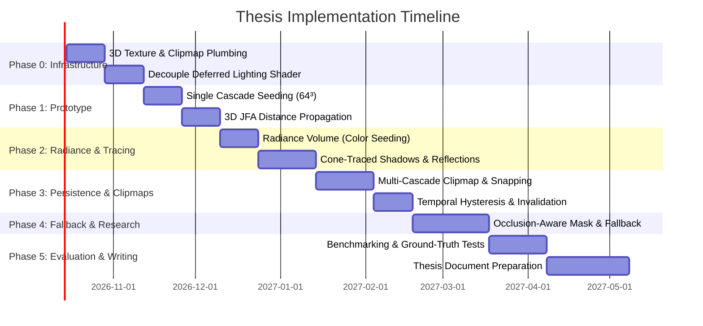

# Depth-Guided Global SDF & Radiance Clipmaps
**Master's Thesis Proposal & Architectural Feasibility**

**Target:** Real-Time Global Distance & Radiance Fields for Hybrid Raster/Ray-Marching Engines  
**Engine:** `weird-engine` (`libWeirdEngine`)  
**Scope:** Primary focus on **textured triangle meshes**; analytic SDF shapes as an integrated secondary primitive.

---

## 1. Executive Summary & Thesis Framing

### 1.1 Thesis Question
> *"Can camera-projected dual-depth intervals and G-Buffer rasterization be leveraged to seed world-space, temporally persistent 3D SDF and radiance clipmaps in real time, making dynamic off-screen occlusion, soft shadows, and global illumination tractable by strictly bounding fallback evaluation?"*

### 1.2 Core Contribution
Current real-time SDF solutions in production engines either require extensive offline per-mesh precomputation (e.g., Unreal Engine 5 Lumen's mesh distance fields) or rely on coarse, opacity-based voxelization without exact surface distances (e.g., NVIDIA VXGI).

This work proposes an **adaptive depth-guided hybrid pipeline**:
1. **Depth & Radiance Seeding:** Repurposes existing raster G-Buffer and back-face depth passes to unproject closed surface intervals (`[z_front, z_back]`) and textured mesh albedo/radiance directly into a multi-cascade 3D clipmap.
2. **Fast Distance Propagation:** Evaluates 3D Jump Flooding (JFA) on the seeded surface voxels to construct Euclidean distance fields in `O(log N)` passes.
3. **Occlusion-Aware Fallback:** Dynamically marks voxels that lie in camera blind spots (behind back faces, outside the frustum, or occluded) with a validity mask. Costly mesh-to-SDF evaluation (local triangle tests or sparse baker fallbacks) is **strictly bounded** to these blind regions, while valid world-space voxels persist temporally.
4. **Voxel Radiance Clipmap:** Stores surface albedo / pre-lit radiance alongside distance, enabling unified cone-traced reflections and indirect bounces for textured meshes.
5. **Decoupled Deferred Architecture:** Separates geometric ray-marching from lighting. Shadow rays and indirect bounces no longer evaluate procedural shape trees per march step; instead, they perform cheap trilinear texture taps into the global clipmap.

---

## 2. Inventory of Existing Engine Capabilities

The `weird-engine` codebase provides an exceptionally high degree of reuse for this research:

| Capability | In-Engine Location | Role in Proposed Thesis Pipeline |
|---|---|---|
| **Dual-Depth Pass** | `MeshRenderPipeline.cpp:98-128` | Shipping back-face depth pass (`GL_DEPTH_COMPONENT32F`, front-face culling, reversed test). Generalizes to cascade camera rigs. |
| **Mesh G-Buffer** | `MeshRenderPipeline.cpp:68-96` | 4 MRTs: albedo, world position, normal, material ID + front depth. Directly seeds surface radiance and entry points. |
| **Screen-Space Mesh SDF** | `sdf_raymarching.frag:468-535` (`meshSDF()`) | Current baseline. Projects world points to camera screen-space slabs. Provides immediate ground-truth comparison for thesis evaluation. |
| **2D Jump Flooding (JFA)** | `jump_flood_init.frag`, `jump_flood_step.frag`, `SDF2DRenderPipeline.cpp:681-750` | Full multi-pass ping-pong loop, sub-pixel seed initialization, and distance correction already debugged. Generalizes dimensionally to 3D. |
| **Retained CPU Vertices** | `Mesh.h:27-28`, `Mesh.cpp` | Retains CPU-side triangle buffers after GPU upload, enabling localized triangle distance queries and offline baking tools without asset pipeline changes. |
| **DataBuffer GPU Array** | `resources/DataBuffer.h` | RGBA32F texture buffer for passing cascade matrices, bounds, and validity headers. |
| **Monolithic Ray-Marcher** | `sdf_raymarching.frag` (~1250 lines) | Target for architectural decoupling into separate G-Buffer compositing, SDF geometry, and deferred lighting passes. |

---

## 3. Detailed Pipeline Architecture

### 3.1 Pipeline Flow & Pass Decoupling

The monolithic `sdf_raymarching.frag` is split into distinct geometry, volume generation, and deferred lighting passes:

```
[Frame Start]
      │
      ├─► (1) Mesh G-Buffer Pass (MeshRenderPipeline)
      │         • Rasterizes triangle meshes into MRTs: Albedo, Normal, WorldPos, Material, Depth
      │         • Rasterizes Back-Face Depth pass for thickness intervals [z_front, z_back]
      │
      ├─► (1.5) Global SDF & Radiance Pipeline [NEW THESIS COMPONENT]
      │         • Cascade Depth Injection: Unproject intervals into 3D clipmap cascades
      │         • Dual-Stream Seeding:
      │             - Distance Volume (R16F): Surface boundary d=0, slab interior d < 0
      │             - Radiance Volume (RGBA8): Textured mesh albedo / pre-lit radiance
      │             - Validity Mask (R8): In-frustum, front-facing, depth-tested flags
      │         • 3D Jump Flooding: 7 passes per cascade (26-neighbor taps) for Euclidean distance
      │         • Occlusion-Aware Fallback: Evaluates bounded mesh SDF only on unvisited/invalid voxels
      │         • Temporal Hysteresis: Persists valid world-space data across camera translation
      │
      ├─► (2) SDF Geometry Pass (SDF3DRenderPipeline - Refactored)
      │         • Primary ray-march for analytic shapes only (Shape AST / ECS)
      │         • Writes Shape G-Buffer (WorldPos, Normal, Material, Depth)
      │         • Resolves primary depth against Mesh G-Buffer (depth test composite)
      │
      └─► (3) Unified Deferred Lighting & GI Pass [NEW]
                • Inputs: Composited G-Buffer, Global SDF Clipmap, Global Radiance Clipmap
                • Direct Lighting: Evaluated at surface hit points
                • Hard / Soft Shadows: Cone-march through t_globalSDF (fast trilinear taps)
                • Reflections:
                    - Screen-Space Reflections (SSR) for sharp, on-screen contacts
                    - Global SDF Cone Tracing for off-screen / rough reflections (sampling t_globalColor)
                • Diffuse GI: Cosine-weighted cone tracing through t_globalSDF + t_globalColor
                • Temporal Accumulation / Denoising
```

---

## 4. Multi-Volume Clipmap Specification

Each cascade is a camera-centric, world-axis-aligned 3D voxel grid snapping to voxel units:

### 4.1 Volume Streams (Per Cascade)

1. **Distance Field (`R16F`):**
   - Stores signed Euclidean distance in world units.
   - Negative inside closed mesh slabs, zero at surfaces, positive in free space.
   - Used for sphere tracing (shadows) and cone tracing (AO, glossy reflections, diffuse bounces).

2. **Radiance / Color Field (`RGBA8`):**
   - Stores textured mesh albedo (or pre-lit surface radiance from previous frame's deferred pass).
   - Alpha channel stores surface emissivity / confidence weight.
   - Enables indirect bounces to gather actual mesh colors and textures without evaluating procedural materials.

3. **Validity & Temporal Mask (`R8`):**
   - Bit 0: Depth-covered this frame (direct camera visibility).
   - Bit 1: Occluded / blind spot (candidate for fallback evaluation).
   - Bits 2–7: Temporal hysteresis counter (age / persistence confidence).

### 4.2 Memory Budget (4 Cascades)

| Cascade Resolution | Distance (R16F) | Radiance (RGBA8) | Validity (R8) | Total VRAM |
|---|---|---|---|---|
| **$4 \times 64^3$** (Coarse/Mobile) | 2.0 MB | 4.0 MB | 1.0 MB | **~7.0 MB** |
| **$4 \times 128^3$** (Target Quality) | 16.0 MB | 32.0 MB | 8.0 MB | **~56.0 MB** |
| **$4 \times 256^3$** (High-End Desktop) | 128.0 MB | 256.0 MB | 64.0 MB | **~448.0 MB** |

*Recommendation:* Target $4 \times 128^3$ (~56 MB VRAM) for the thesis prototype, with an optional $64^3$ fallback profile.

---

## 5. Lighting, Shadows & Indirect Illumination

### 5.1 Primary Thesis Deliverables
The thesis focuses on three lighting effects that directly demonstrate the value of a world-space persistent SDF + radiance clipmap:

1. **Persistent Soft Shadows:** Cone-march through the distance clipmap to evaluate occlusion between surfaces and lights. Off-screen geometry correctly casts shadows — the primary visual defect the thesis eliminates.
2. **World-Space Ambient Occlusion:** Short-range cone traces in a hemisphere around the surface normal sample the distance field for local occlusion. Unlike screen-space AO (SSAO), this captures occlusion from geometry outside the camera frustum.
3. **Diffuse Indirect Bounces (GI):** Cosine-weighted cone traces sample the radiance clipmap for indirect color contribution. Wide cones naturally match the clipmap voxel resolution, producing physically plausible diffuse color bleeding between surfaces.

### 5.2 Reflections (Simplified, Not Primary Focus)
Reflections use a single cone trace through the distance clipmap, sampling the radiance volume at the hit point. The cone aperture is tied to surface roughness — rougher surfaces produce wider cones, which naturally match the clipmap resolution and hide voxel-scale detail:

$$\theta = \arctan(\text{roughness})$$

This produces rough but geometrically correct reflections: off-screen geometry appears in reflections, colored by the radiance volume. The quality is comparable to a single-bounce diffuse GI trace with a narrower cone.

**Acknowledged limitation:** Sharp mirror reflections exceed what the clipmap resolution can deliver. Screen-space reflections (SSR) against the full-resolution G-Buffer depth are the natural extension for sharp on-screen contacts, left as future work. The architecture supports this cleanly — SSR would run first, with the clipmap cone trace as fallback for misses.

### 5.3 Decoupling Advantages for Deferred Lighting
In the current engine, evaluating a shadow ray or indirect bounce in `sdf_raymarching.frag` requires re-evaluating the entire analytic shape tree (`sceneSdf()`) plus `meshSDF()` on every ray-march step (up to 64–128 steps per ray).

With the Global SDF:
- Shadow and bounce loops replace expensive AST code branches with a single hardware-interpolated `texture(t_globalSDF, p)` fetch.
- The lighting shader is completely decoupled from shape generation (`#include "shapes"` is eliminated from the lighting pass).
- Mesh surfaces and analytic shapes share the exact same lighting, shadowing, and GI code path.

---

## 6. Novel Research Challenges & Mitigations

### 6.1 Depth-Interval Ambiguity (Non-Convex / Multi-Layer Meshes)
- **Problem:** A single raster pass captures only the first front face and last back face `[z_front, z_back]`. Concave geometry (e.g., hollow pipes, arches, complex foliage) would falsely classify interior voids as solid.
- **Mitigation:**
  - Conservative surface seeding: Only voxels immediately adjacent to `z_front` and `z_back` receive strict zero-distance seeds; interior voxels receive negative bounds with relaxed confidence.
  - Multi-layer depth peeling option for local hero assets.
  - Verification during the thesis: Measure shadow leakage on non-convex benchmark meshes (e.g., Stanford Dragon, architectural arches).

### 6.2 3D JFA Thin-Wall Leakage
- **Problem:** Jump flooding with stride $k$ can jump completely over 1-voxel thin walls, propagating distances across geometry boundaries.
- **Mitigation:**
  - Apply 1-voxel distance correction pass (already proven in the engine's 2D JFA pipeline via `distance_correction.frag`).
  - Conservative surface dilation during seeding.

### 6.3 Temporal Stability & Camera Motion
- **Problem:** When the camera translates, clipmap origins snap to voxel grids, which can cause distance and color shimmer.
- **Mitigation:**
  - Toroidal addressing / clipmap coordinate wrapping to shift voxel data without re-allocating.
  - Hysteresis weighting: Require consecutive invalid frames before purging cached distance/radiance.
  - Temporal exponential moving average (EMA) on color volume updates.

---

## 7. Master's Thesis Evaluation & Experimental Methodology

To satisfy academic thesis requirements in game development / computer graphics, the implementation will be evaluated quantitatively and qualitatively:

### 7.1 Quantitative Benchmarks
1. **Geometric Accuracy vs. Ground Truth:**
   - Compute exact Euclidean distance fields via offline brute-force triangle mesh evaluation.
   - Measure Mean Absolute Error (MAE) and Root Mean Square Error (RMSE) of the depth-seeded JFA field across varying camera angles and mesh complexities.
2. **Performance & Frame-Time Breakdown:**
   - Profile individual pipeline stages via GPU timer queries (`Profiler::get().gpuSync()`):
     - G-Buffer & back-depth rasterization time.
     - 3D Voxel seeding dispatch time.
     - 3D JFA passes ($\log_2 N$ iterations).
     - Occlusion fallback evaluation cost.
     - Deferred lighting & cone-tracing pass time.
   - Compare total frame time against the baseline screen-space `meshSDF()` shader.
3. **Bandwidth & Cache Scaling:**
   - Measure VRAM throughput during cascade update passes across $64^3$, $128^3$, and $256^3$ clipmap resolutions.
4. **Camera Dynamics & Fallback Pressure:**
   - Graph the percentage of active blind voxels as a function of camera angular velocity ($\deg/\text{s}$) and translational speed.

### 7.2 Qualitative Validation
- **Visual Stability:** Screen-space capture comparisons showing elimination of off-screen shadow/reflection popping when rotating away from large occluders.
- **Side-by-Side Artifacts:** Test against benchmark test scenes (Sponza Atrium, Stanford Bunny/Dragon, dynamic moving character meshes).

---

## 8. Phased Implementation Roadmap



### Milestone Details
- **Phase 0 (Plumbing & Decoupling):**
  - Add `Texture3D` wrapper and layered FBO attachments to `weird-renderer`.
  - Extract lighting math from `sdf_raymarching.frag` into `DeferredLightingPipeline`.
- **Phase 1 (Single-Cascade Distance Core):**
  - Implement 3D JFA compute/pixel passes; verify Euclidean accuracy on static meshes.
- **Phase 2 (Radiance & Lighting Integration):**
  - Hook G-Buffer albedo into the seeding pass; implement cone tracing for soft shadows and off-screen rough reflections.
- **Phase 3 (Cascades & Temporal Persistence):**
  - Build 4-level clipmap hierarchy with camera-snapped bounds and persistence across camera motion.
- **Phase 4 (Occlusion-Aware Fallback - Core Novelty):**
  - Implement validity mask tracking and evaluate localized fallback queries for occluded/blind voxels.
- **Phase 5 (Evaluation & Defense):**
  - Run automated test rigs, gather performance metrics, and complete thesis manuscript.
